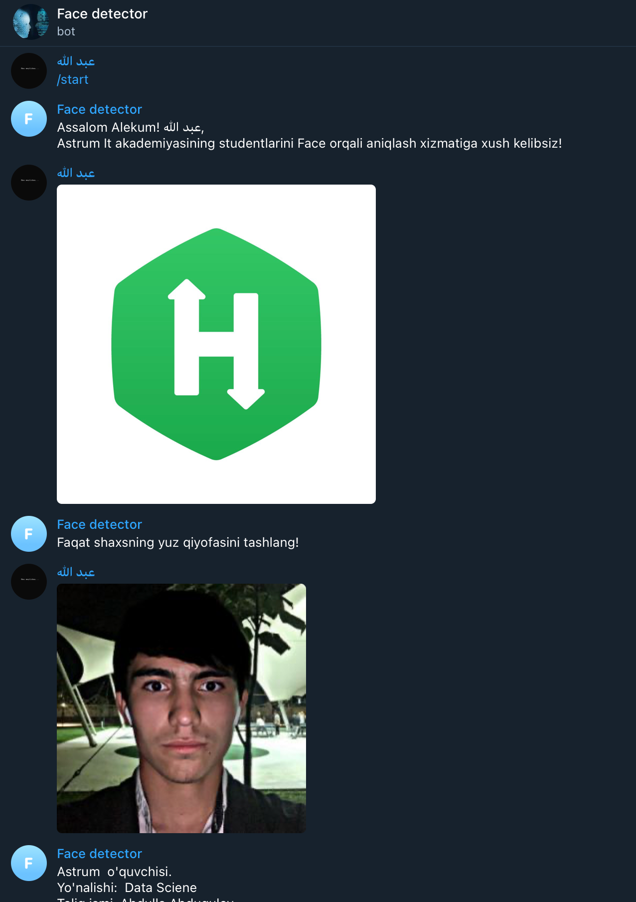
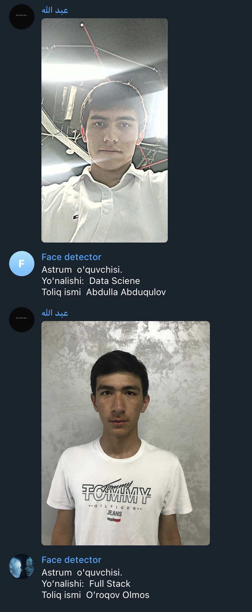

# Face-student-identification-project

Bu botning asosiy vazifasi - Astrum studentlarini yuzi orqali student haqida ma'lumotlarni olishdir.

Botga rasm tashlanadi va bot rasmni qabul qilib rasmni encode ga aylantiradi. Keyin rasmini json fayldagi ma'lumotlar bilan solishtiradi agar ma'lumot to'g'ri kelsa. Barcha ma'lumotlarini jo'natadi.

